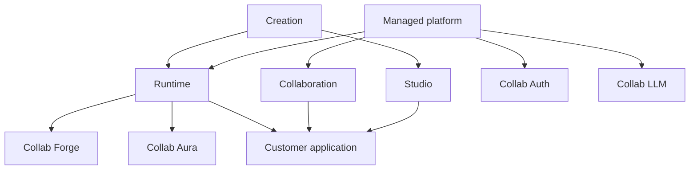

Collab.codes can be understood as a set of product layers around a generated business application.

## How to read the diagram

Creation defines and evolves the application.

Runtime executes the generated application.

Collaboration keeps communication, tasks, agents, and contextual tools close to the business workflow.

Managed platform services provide identity, LLM access, cost control, and operational support.

## Product boundary

Studio, Build, and publication deserve dedicated documentation.

This reference page only shows how the major concepts relate.
