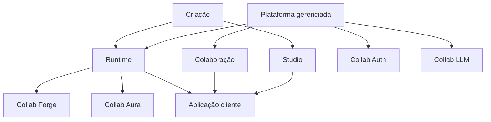

Collab.codes pode ser entendido como um conjunto de camadas de produto ao redor de uma aplicação empresarial gerada.

## Como ler o diagrama

Criação define e evolui a aplicação.

Runtime executa a aplicação gerada.

Colaboração mantém comunicação, tasks, agentes e ferramentas contextuais perto do workflow de negócio.

Serviços da plataforma gerenciada oferecem identidade, acesso a LLM, controle de custos e suporte operacional.

## Fronteira de produto

Studio, Build e publicação merecem documentação dedicada.

Esta página de referência mostra apenas como os conceitos principais se relacionam.
